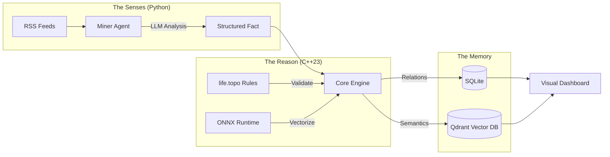

# 🏛️ TopoLogos: The Engine of Structural Existentialism

> "Intelligence is not about finding the optimal path instantly, but about pruning the inefficient paths immediately."

**TopoLogos** is a **Hybrid Neuro-Symbolic Knowledge Graph Engine** built with **Modern C++ (C++23)** and **Python**.

Unlike traditional RAG systems or simple RSS readers that passively ingest information, TopoLogos **"compiles"** raw information into a rigorous knowledge structure. It enforces physical and structural constraints while preserving semantic meaning through vector embeddings.

---

## 🧐 Philosophy: Structural Existentialism

This project explores the intersection of **Computer Science** and **Philosophy**.

1.  **Structure (The Constraints):** The system enforces physical (Entropy) and structural (Fragility) laws. High-entropy claims (e.g., "Get Rich Quick") are mathematically rejected.
2.  **Existentialism (The Refusal):** The system defines its own truth by **"pruning"** unwanted paths. Growth is achieved not by accumulation, but by eliminating inefficiencies.
3.  **Neuro-Symbolic Architecture:** Combines the **intuition** of LLMs with the **rigor** of C++ logic.

---

## 🏗️ System Architecture

TopoLogos operates as a living organism with distinct organs for sensing, reasoning, and remembering.

1. The Senses (Miner)
Tech: Python, Ollama (Mistral/Llama3)

Role: Crawls feeds and uses a Local LLM to extract qualitative attributes like Text Clarity, Urgency, and Energy-Reward Ratio.

Source: tools/miner.py

2. The Reason (Engine)
Tech: C++23, ONNX Runtime, Custom AST Parser

Role:

Rule-Based Filtering: Applies rigorous logic defined in life.topo (e.g., "If reward > 1000x input, discard").

Neural Embedding: Generates semantic vectors using BERT (Mean Pooling + L2 Norm).

Source: src/main.cpp, src/verification/bullshit_detector.cpp

3. The Memory (Hybrid Storage)
SQLite: Manages structural relationships (Edges, Dependencies).

Qdrant: Manages semantic vectors for intent-based retrieval.

Source: include/topologos/storage/knowledge_graph.hpp

🚀 Key Features
✅ Hybrid Verification: Cross-validates claims using Physics (Entropy) and Psychology (Mental Cost).

✅ Zero-Cost Abstraction: Critical logic is compiled into native C++ binary.

✅ Semantic Understanding: Integrated ONNX Runtime allows the C++ engine to "understand" text meaning.

✅ Anti-Scam Logic: A built-in "Bullshit Detector" filters out logical fallacies.

✅ Dockerized: Fully isolated microservices architecture.

🛠️ Usage
1. Prerequisites
Docker & Docker Compose

(Optional) NVIDIA GPU for faster LLM inference

2. Define Reality (config/life.topo)
Write your structural constraints in the TopoLogos DSL.

JavaScript
domain Physics {
    axiom Thermodynamics {
        // Reject claims where reward is disproportionately high compared to effort
        rule NoFreeLunch(input_energy: float, promised_reward: float) {
            threshold: 1000.0;
            condition: promised_reward <= (input_energy * threshold);
            failure_msg: "Thermodynamics Violation: Infinite Upside detected.";
        }
    }
}
3. Boot the System
Bash
# Build and start all services (Miner, Engine, DB, Dashboard)
docker-compose up --build -d

# Watch the system think
docker-compose logs -f
4. Visualize
Access the Dashboard at http://localhost:5001 to see your personal Knowledge Graph growing.

📝 License
MIT License
